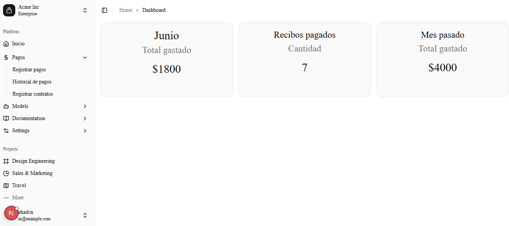
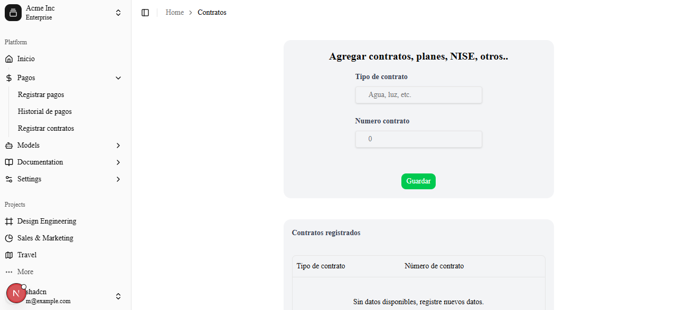
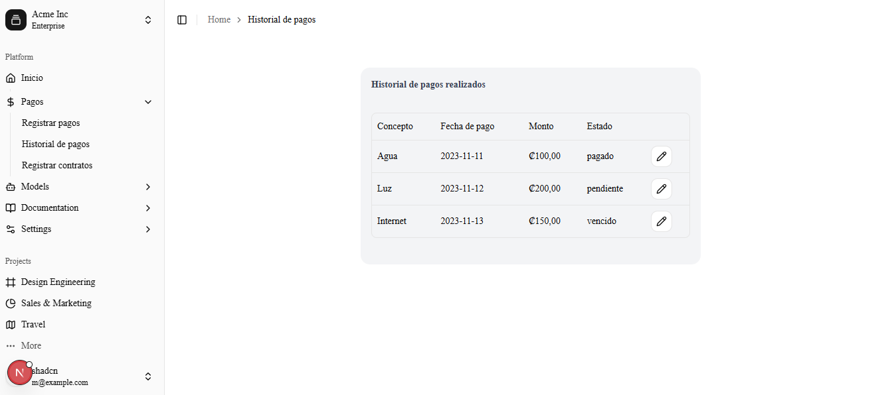

# App Recibos

Sistema web para gestionar pagos, recibos y contratos de servicios desde una interfaz centralizada.

> 🚧 En desarrollo activo — MVP funcional

[Live Demo](...) · [API](...) · [Repositorio](https://github.com/Cabal11/gestor-recibos.git)

## Preview





## Características

- 📊 Dashboard con resumen de pagos y gastos
- 💳 Registro y gestión de pagos
- 📋 Historial con edición y eliminación
- 📄 Gestión de contratos
- ✅ Validación de datos con Zod
- 🔌 API REST con Express y TypeScript


## Estado actual

El proyecto se encuentra en desarrollo activo. Actualmente cuenta con un frontend funcional y una API REST para la gestión de pagos y contratos.. Ya cuenta con:

- panel principal con resumen de indicadores
- formulario para registrar pagos
- historial de pagos con edición y eliminación
- módulo para registrar y administrar contratos
- validación del lado del cliente con Zod
- API REST en Express para pagos y contratos

Todavía no está conectada una base de datos final ni se ha definido la capa de autenticación/usuarios, por lo que la solución sigue en una etapa inicial de preparación para producción.

## Objetivo del proyecto

Centralizar y simplificar el registro de recibos y contratos, reduciendo el trabajo manual y mejorando la trazabilidad de pagos con un flujo visual y más organizado.

## Stack tecnológico

- Next.js 16
- React 19
- TypeScript
- Tailwind CSS
- shadcn/ui
- Express + TypeScript
- Zod para validación


## Arquitectura

La aplicación está dividida en un frontend desarrollado con Next.js y una API REST independiente desarrollada con Express.

```text
┌─────────────────────┐
│      Next.js        │
│   React + TypeScript│
└──────────┬──────────┘
           │ HTTP
           ▼
┌─────────────────────┐
│       Express       │
│     REST API        │
└──────────┬──────────┘
           │
           ▼
┌─────────────────────┐
│     Persistencia    │
│   (en desarrollo)   │
└─────────────────────┘
```

## Funcionalidades implementadas

### Dashboard

- resumen visual con tarjetas de indicadores
- vista base para métricas de pagos y gastos
- navegación por secciones principales del sistema

### Registrar pagos

- registro de recibos con:
  - tipo
  - fecha
  - monto
  - estado (pagado, vencido, pendiente)
- validación de formulario antes del envío

### Historial de pagos

- consulta de registros recientes
- edición de pagos
- eliminación de pagos
- listado tipo tabla para revisión rápida

### Contratos

- registro de contratos o servicios
- búsqueda/gestión por tipo y número
- edición y eliminación

## Estructura del proyecto

```bash
app/
  dashboard/
  services/
backend/
  src/
components/
lib/
shared/
types/
```

## Requisitos

- Node.js 20 o superior
- npm

## Instalación

1. Clona el proyecto:

```bash
git clone <url-del-repositorio>
cd app-recibos
```

2. Instala dependencias del frontend:

```bash
npm install
```

3. Instala dependencias del backend:

```bash
cd backend
npm install
```

## Variables de entorno

Para que el frontend pueda comunicarse con la API local, crea un archivo `.env.local` en la raíz del proyecto con algo similar a:

```bash
API_URL_DEV=http://localhost:4001/api
```

## Ejecutar el proyecto

### Frontend

```bash
npm run dev
```

La aplicación queda disponible en:

```text
http://localhost:3000
```

### Backend

```bash
cd backend
npm run dev
```

El backend queda disponible en:

```text
http://localhost:4001
```

## API actual

La API en Express ofrece endpoints básicos para pagos y contratos:

### Pagos

- `GET /api/pagos`
- `POST /api/pagos`
- `PUT /api/pagos/:id`
- `DELETE /api/pagos/:id`

### Contratos

- `GET /api/contratos`
- `POST /api/contratos`
- `PUT /api/contratos/:id`
- `DELETE /api/contratos/:id`

## Próximos pasos

- conectar la app a una base de datos real
- definir modelo definitivo de datos y persistencia
- mejorar la lógica de reportes y dashboards
- añadir autenticación y roles
- agregar exportación de recibos y reportes
- mejorar validaciones y manejo de errores
- cubrir la app con pruebas automatizadas

## Nota

Este README refleja el estado actual del proyecto y no el contenido base generado por Create Next App. El proyecto está evolucionando hacia una aplicación de control financiero más completa, pero aún requiere consolidación de backend, persistencia y flujo de negocio completo.
